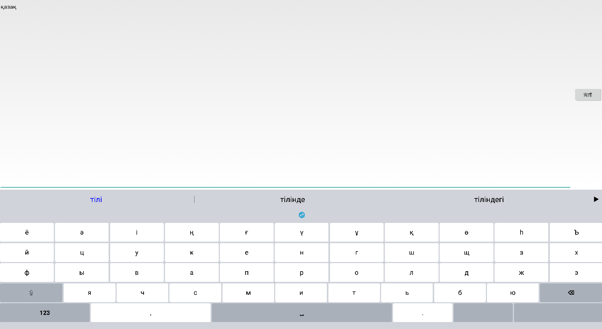
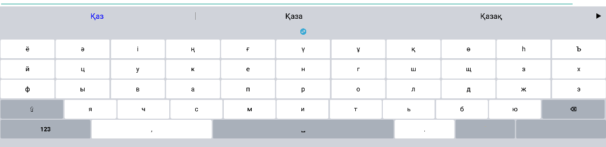
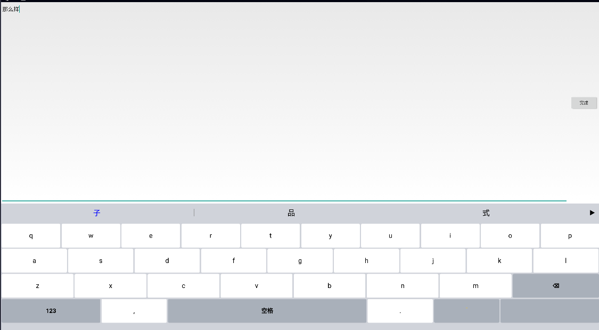
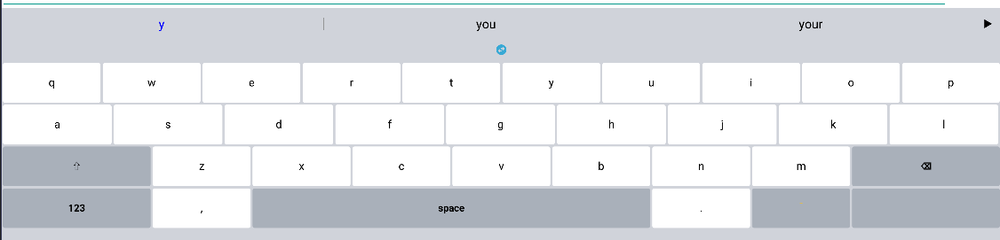
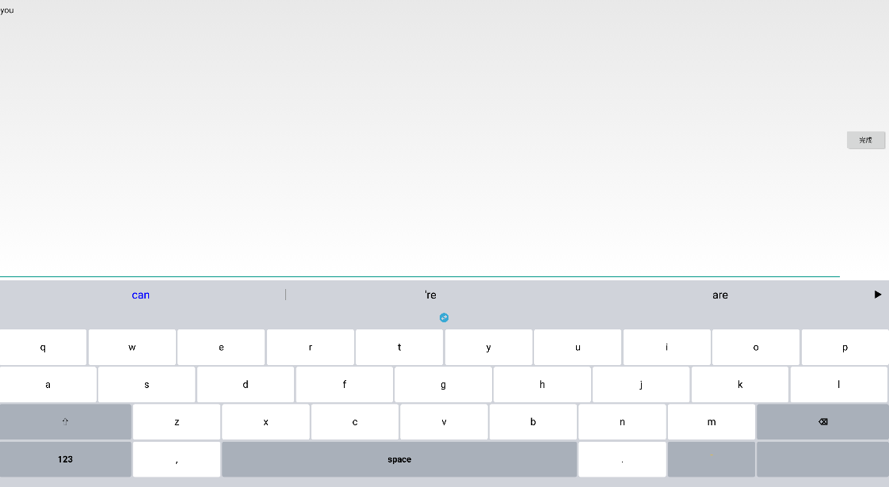
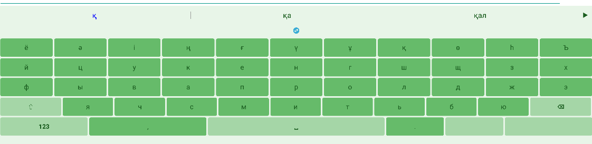

# Nasboard

**A fully offline, secure multilingual input method for Android built with Jetpack Compose.**

Nasboard is designed with user privacy and security in mind: it **does not require network or storage permissions**, so your input and personal data remain completely safe.

---

## Key Features

### 1. Multilingual Support
- Kazakh (Latin, Cyrillic, Arabic) with **real-time script conversion**  
  - Example: Users who only know Latin Kazakh can type in Latin on the keyboard, but the submitted text can automatically be converted to Cyrillic or Arabic Kazakh using the keyboard's conversion button.
- English  
- Chinese  
- Russian  

### 2. Advanced Input Capabilities
- **Unigram and bigram dictionaries**  
- **User dictionary learning**  
- **Auto-correction**  
- **Character conversion** between supported scripts  
- **Custom language loading**  

### 3. High Performance
- Binary double-array trie data structure for dictionaries  
- Built-in dictionaries, low memory usage  
- Fast input and response  

### 4. User Experience
- **Theme switching**  
- **Emoji support**  
- Smooth Jetpack Compose interface  

---

## Screenshots

### Kazakh Keyboard & Bigram Example
  
  

### Chinese Keyboard & Bigram Example
  
  

### English Keyboard & Bigram Example
  
  

### Themes
  

---

## How It Works

- Entirely offline: no network or storage access required  
- Jetpack Compose based UI for smooth, modern interface  
- Script conversion allows Kazakh users to switch between **Latin, Cyrillic, and Arabic scripts** on the fly  
- Built-in dictionaries are optimized for speed and memory  

---

## Installation

1. Clone the repository:

```bash
git clone https://github.com/Nasihat-7/Nasboard.git
